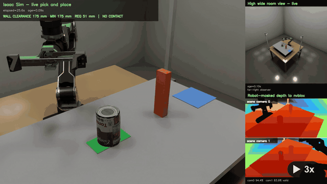

# reArm B601-DM Isaac ROS Manipulation

A source-only adaptation of NVIDIA's
[Isaac for Manipulation reference architecture](https://nvidia-isaac-ros.github.io/reference_workflows/isaac_for_manipulation/index.html)
for the Seeed Studio
[reArm B601-DM](https://www.seeedstudio.com/reBot-Arm-B601-DM-p-6740.html).

The simulation detects a bottom-up soup can with Grounding DINO, estimates its
6-DoF pose with FoundationPose, builds a two-camera nvblox map, plans around a
hard transfer wall with cuMotion, grasps through physical finger contact,
rotates the can upright, and releases it under gravity. The orchestration is the
Isaac ROS pick-and-place behavior tree.

This repository is intentionally an overlay, not a copy of NVIDIA and Seeed
repositories. It tracks:

- project-owned reArm simulation and ROS packages;
- one reviewable patch against a pinned Isaac ROS revision;
- immutable upstream source pins;
- build/run automation and focused tests; and
- the synchronized full-flow capture tool.

Downloaded source, vendor geometry, models, TensorRT engines, build output,
logs, frames, and runtime captures are generated locally and ignored by Git.
The curated demonstration under `media/` is the only video intentionally
tracked in this repository.

**Status:** simulation only. Transferring the workflow to the physical arm is
the next engineering phase.

## Demonstration

[](media/rearm_b601dm_full_flow_demo.mp4)

**[Watch or download the full demonstration (MP4)](media/rearm_b601dm_full_flow_demo.mp4)**

The animation above plays directly in the README at 2x speed without audio.
Click it for the full-resolution, real-time H.264 recording.

The edited 51-second, 1920x1080 demonstration shows the complete successful
flow followed by a short development-bloopers section. In the successful run:

1. Grounding DINO detects the bottom-up soup can.
2. FoundationPose estimates and visualizes the object's 6-DoF pose.
3. Two fixed depth cameras feed robot-masked depth into nvblox.
4. cuMotion plans a collision-free approach and carried-object transfer around
   the wall.
5. The gripper closes through simulated finger contact rather than attaching
   or teleporting the can.
6. The robot lifts the can, rotates it upright, places it on the destination,
   opens the jaws, and lets gravity complete the release.

The recording is H.264 at 30 FPS. Its SHA-256 is
`a56955ffa8c7e2c08221cc878bcb580b28d048085c4949581e95cd866c566220`.
The MP4 is presentation evidence; the authoritative success condition for a
fresh run remains the fail-closed `--require-complete` command and its logs.

## What This Repository Implements

- a canonical B601-DM robot description with simulation and cuMotion variants;
- an Isaac Sim scene with a dynamic can, physical gripper contact, two RGB-D
  viewpoints, and a hard transfer-wall obstacle;
- open-vocabulary Grounding DINO detection and FoundationPose 6-DoF estimation;
- robot-masked two-camera nvblox reconstruction and carried-object-aware
  cuMotion planning;
- ROS 2 control, joint-state, and gripper adapters for the reArm integration;
- axial-object pose handling for top-up and bottom-up can orientations;
- deterministic upstream reconstruction from pinned revisions and one
  reviewable NVIDIA overlay patch; and
- synchronized multiview recording, diagnostics, and fail-closed task gates.

## Requirements

- Ubuntu 22.04 x86_64
- NVIDIA GPU, driver, Docker Engine, and NVIDIA Container Toolkit
- Isaac Sim 5.1 at `$HOME/isaacsim-5.1`, or `ISAACSIM_ROOT` set
- Python 3 with `venv`
- Git and at least 40 GiB free disk space
- `ffmpeg` only when producing the synchronized MP4

The validated host used an RTX 6000 Ada and driver `580.173.02`. TensorRT
engines are GPU/runtime-specific and are generated during bootstrap.

## Quick Start

The required non-interactive path is exactly these three commands. Run them
from the repository root, in order, and stop if a command exits nonzero.

```bash
# Read-only host checks. Missing source/model warnings are expected initially.
./scripts/preflight.sh

# Fetch source, build the container, install models, test, and build the overlay.
./scripts/bootstrap.sh --accept-eula

# Run one complete behavior-tree goal.
./scripts/run_demo.sh --accept-eula -- --require-complete
```

Bootstrap can include warnings emitted by TensorRT, colcon, and upstream
compiler dependencies. They do not require operator action when the command
exits zero and ends with:

```text
BOOTSTRAP RESULT status=success
```

For an interactive Isaac Sim viewport, replace the third command with the
following command. It is an alternative, not a fourth Quick Start step:

```bash
./scripts/run_demo.sh --accept-eula --gui -- --require-complete
```

The demonstration succeeds only when the command exits zero and ends with:

```text
WORKFLOW RESULT status=1
```

Logs are retained under `.rebot/runs/<UTC timestamp>/`.

`--accept-eula` is an explicit acknowledgement that NVIDIA runtime, model,
NGC, and Isaac Sim terms apply. Review
[`THIRD_PARTY_LICENSES.md`](THIRD_PARTY_LICENSES.md) before using it.

## Source Reconstruction

`dependencies.lock` pins every external tree to a full commit. Bootstrap calls:

```bash
./scripts/fetch_sources.sh
```

That command:

1. checks out NVIDIA Isaac ROS Manipulation;
2. applies `patches/isaac_ros_manipulation.patch`;
3. checks out topic-based ros2_control;
4. sparsely obtains the Seeed B601-DM visual meshes;
5. sparsely obtains the official Seeed Isaac Sim USD; and
6. verifies generated files and the vendor USD checksum.

It is idempotent. Verify an existing tree without network access or mutation:

```bash
./scripts/fetch_sources.sh --check
```

The equivalent upstream repositories and pins are:

| Purpose | Repository | Revision |
|---|---|---|
| Manipulation pipeline and behavior tree | [NVIDIA-ISAAC-ROS/isaac_ros_manipulation](https://github.com/NVIDIA-ISAAC-ROS/isaac_ros_manipulation) | `6ef8d72fee82f5aa0bae207962e9a17ff4306f90` |
| reArm ROS source and visual meshes | [Seeed-Projects/reBotArmController_ROS2](https://github.com/Seeed-Projects/reBotArmController_ROS2) | `39fbea54c7235b1c38bd025fc2e7308e42bd2fbe` |
| Official reArm Isaac Sim USD | [Seeed-Projects/reBot-Isaacsim](https://github.com/Seeed-Projects/reBot-Isaacsim) | `c3ee253ca113ea3514da442684ef5d4894219374` |
| Isaac Sim ros2_control transport | [karanchahal-nv/topic_based_ros2_control](https://github.com/karanchahal-nv/topic_based_ros2_control) | `7ee291ab13adba52ab5889deb9e520009fe2283d` |

To inspect any source manually:

```bash
git clone https://github.com/NVIDIA-ISAAC-ROS/isaac_ros_manipulation.git
git -C isaac_ros_manipulation checkout 6ef8d72fee82f5aa0bae207962e9a17ff4306f90

git clone https://github.com/Seeed-Projects/reBotArmController_ROS2.git
git -C reBotArmController_ROS2 checkout 39fbea54c7235b1c38bd025fc2e7308e42bd2fbe

git clone https://github.com/Seeed-Projects/reBot-Isaacsim.git
git -C reBot-Isaacsim checkout c3ee253ca113ea3514da442684ef5d4894219374
```

Use `fetch_sources.sh` for the runnable workspace because it also creates the
expected paths and applies the NVIDIA patch.

## Run Components Separately

After bootstrap, use three terminals:

```bash
# Terminal 1: host Isaac Sim scene and cameras
./rebot_isaac_ws/docker/reproduce.sh scene 900 --gui

# Terminal 2: Dockerized Grounding DINO, FoundationPose, nvblox, cuMotion, BT
./rebot_isaac_ws/docker/reproduce.sh workflow

# Terminal 3: one complete goal
./rebot_isaac_ws/docker/reproduce.sh goal --require-complete
```

The workflow uses `ROS_DOMAIN_ID=42`, Cyclone DDS, and simulation time on both
sides. Isaac Sim runs on the host; ROS 2 Jazzy and Isaac ROS 4.5 run in Docker.

## Capture the Full Flow

The managed command can produce the same synchronized presentation layout used
during development:

```bash
./scripts/run_demo.sh \
  --accept-eula \
  --capture rebot_isaac_ws/media/rearm_full_flow.mp4 \
  -- --require-complete
```

The 1920x1080 output contains:

- a large live Isaac Sim observer with Grounding DINO and FoundationPose
  projected into the view;
- a high, wide live room perspective; and
- robot-masked nvblox depth from both fixed scene cameras.

Raw camera depth and ESDF data remain in the capture manifest rather than
occupying video panels. Frames, telemetry, and `capture_summary.json` remain
under `rebot_isaac_ws/tmp/captures/<UTC timestamp>/`.

The recorder is stopped and the MP4 is encoded even when the goal fails, so a
failed run remains useful for diagnosis. The command still returns the goal's
nonzero status.

For direct recorder development, the implementation is
`rebot_isaac_ws/sim/capture_pipeline_diagnostics.py`; frame composition helpers
are in `pipeline_diagnostics_render.py`.

## Pipeline

```text
Isaac Sim 5.1 (host)
  reArm + dynamic can + hard wall
  scene_cam_0 RGB/depth ----+
  scene_cam_1 depth --------+---- DDS ---- Isaac ROS 4.5 (Docker)
  joint states/commands ----+               Grounding DINO
                                            FoundationPose
                                            robot segmentation + nvblox
                                            cuMotion + MoveIt
                                            pick-and-place behavior tree
                                            physical gripper bridge
```

The can begins bottom-up. The FoundationPose axis is normalized for an axial
object, grasp candidates are rotated consistently, and the behavior tree plans
the complete carried-can volume around the wall before opening the jaws at the
place pose.

## Validation

The complete tests inspect patched NVIDIA files and generated vendor assets, so
materialize the pinned sources before running them directly:

```bash
./scripts/fetch_sources.sh
python3 -m venv .venv
.venv/bin/python -m pip install -r requirements-dev.txt
PYTEST_DISABLE_PLUGIN_AUTOLOAD=1 \
  .venv/bin/python -m pytest -q rebot_isaac_ws/test
```

`./scripts/bootstrap.sh --accept-eula` performs those steps as part of the
supported preparation path and stops on any failed test or build gate.

Models, tests, clean colcon build, and overlay resolution:

```bash
./rebot_isaac_ws/docker/reproduce.sh prepare
```

Full GPU/ROS/PhysX validation:

```bash
./scripts/run_demo.sh --accept-eula -- --require-complete
```

## Repository Map

| Path | Purpose |
|---|---|
| `dependencies.lock` | Immutable external source revisions |
| `patches/` | Project changes to pinned upstream source |
| `scripts/fetch_sources.sh` | Deterministic source/materialization step |
| `scripts/bootstrap.sh` | Complete setup and build gate |
| `scripts/run_demo.sh` | Managed end-to-end run and optional capture |
| `rebot_isaac_ws/sim/` | Scene, contact physics, wall safety, goal, capture |
| `rebot_isaac_ws/config/` | Behavior tree, grasps, XRDF, and scene object |
| `rebot_isaac_ws/src/rebot_b601dm_*` | Project-owned reArm ROS packages |
| `rebot_isaac_ws/docker/` | Isaac ROS 4.5 image and overlay tooling |
| `rebot_isaac_ws/test/` | Host-safe runtime and reconstruction contracts |

## License

Project-owned source is Apache-2.0. Upstream code, assets, downloaded models,
containers, and runtime-streamed content retain their own terms; see
[`THIRD_PARTY_LICENSES.md`](THIRD_PARTY_LICENSES.md).
